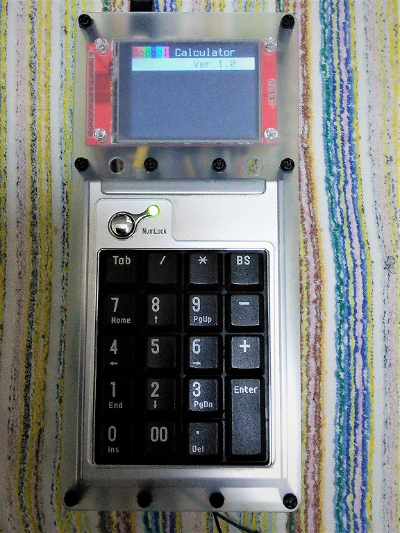
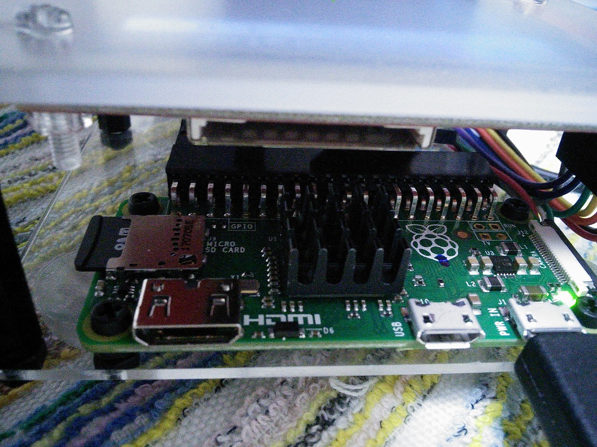
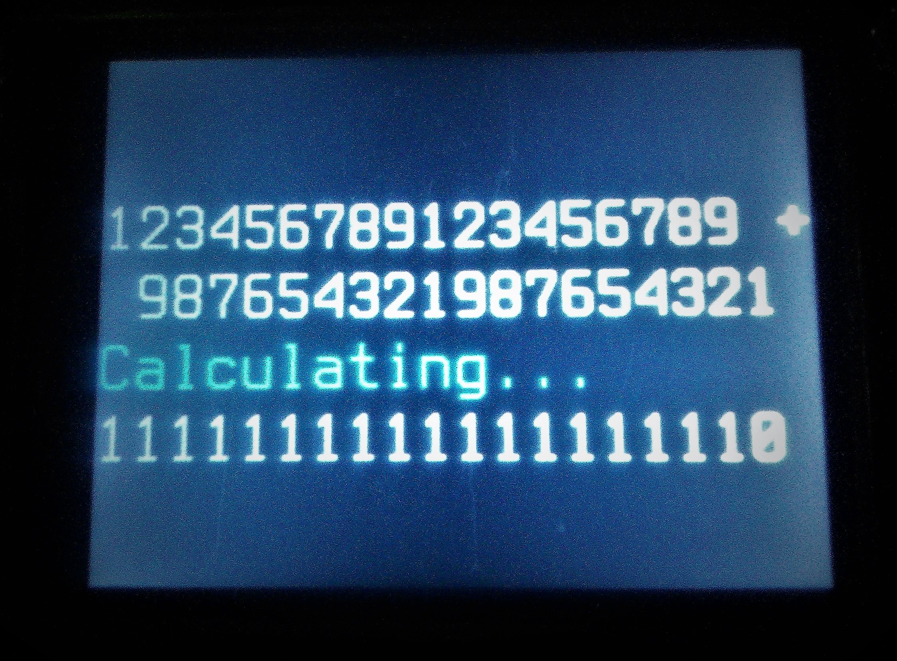
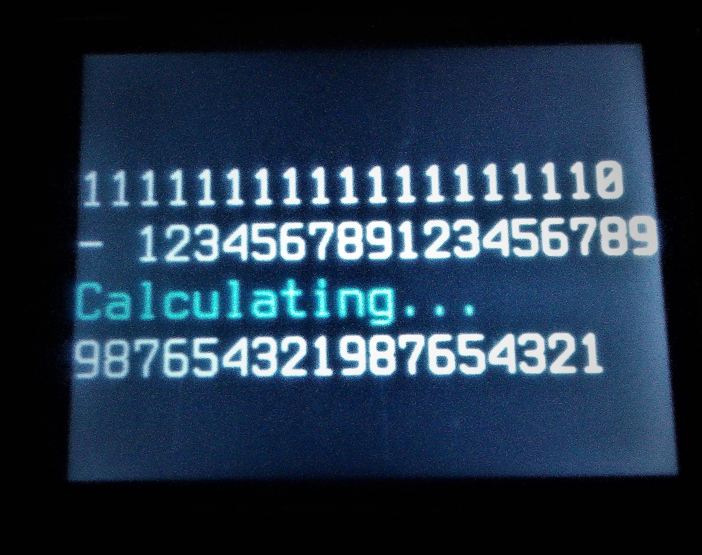
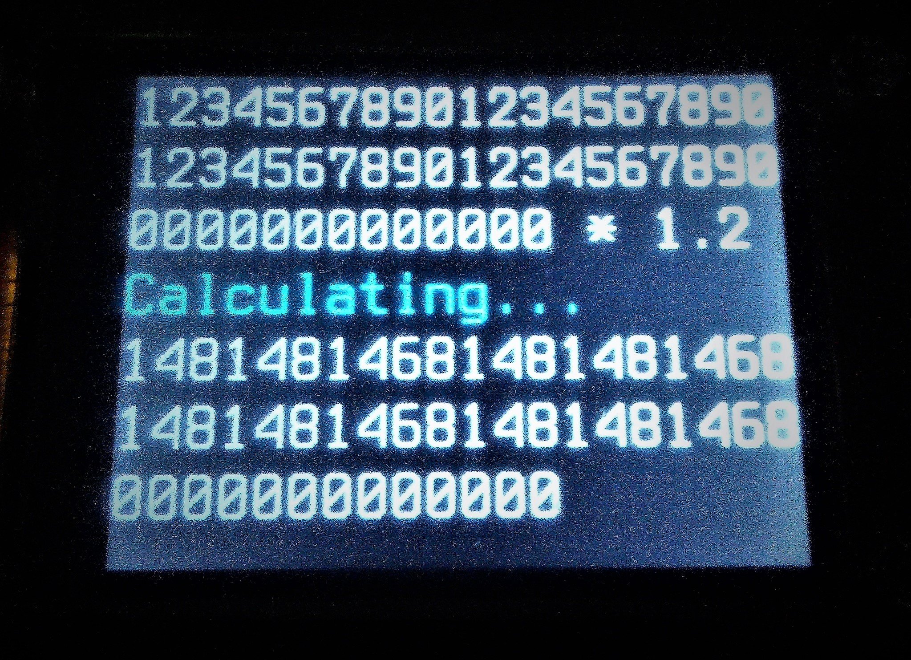
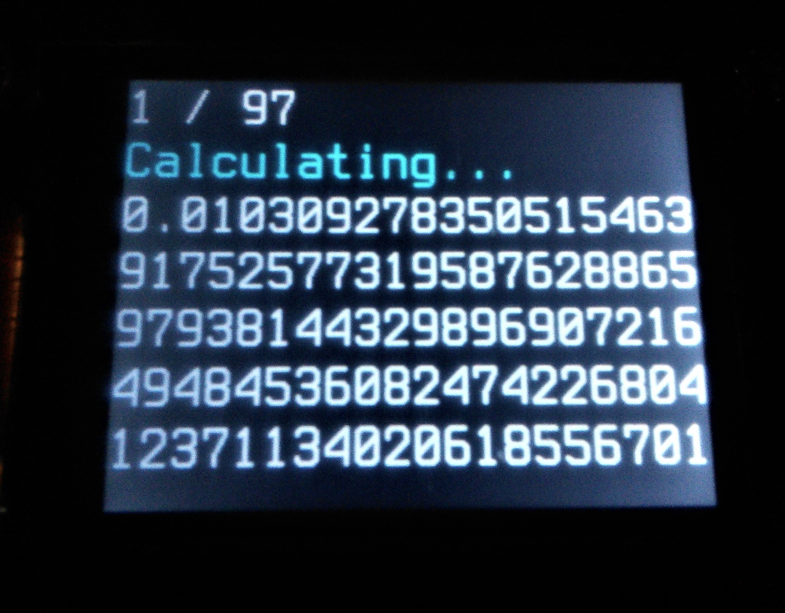
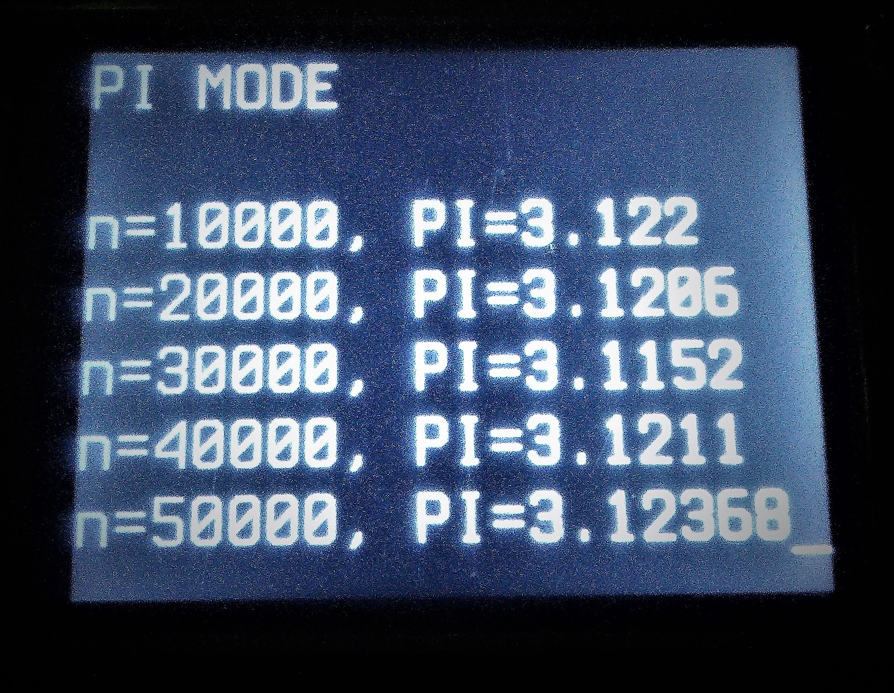

# Pythonによる多桁計算
このプログラムは、中学生にプログラムを教えるため、たし算とひき算を使って多桁計算を実装しました。動作はRaspberry Pi版のPython3.5.3とWindows版のPython3.6.5で確認しています。<br>多桁の計算が出来るようになったので、Raspberry Pi Zeroという小さいけど高機能なマイコンを使ってオリジナルの電卓を作ってみました。電卓の名前は、10の100乗を表すGoogoleからGoogole Calculator(グーゴルカルキュレーター）としました。<br>TaketaCalc.py内で定義しているKETAの値を変更すると、任意の桁数の小数点で符号付きの計算することが可能です。例は100桁です。
```Python
# 桁数の設定
KETA = 100
```
## 実行方法
実行はRsapberry Pi、Windowsのコマンドラインからプログラムが置かれたディレクトリへ移動して以下のコマンドを実行してください。
```
python3 GoogolCalculator.py
```
## 使用にあたり
このプログラムは、多桁の四則演算の仕組みを中学生、小学高学年が知っている算数を用いて教えるのを主な目的として作成しました。ですので、**速度はかなり度外視**しています。構造的に右辺と左辺両方が5桁を超えた場合の速度は実用的ではありません。<br>**相当な忍耐と覚悟をもって実行してください。**<br>1÷97など少ない桁で1000桁の循環小数を確認する場合は気にならないと思いますが…どうしても速度が気になる方は各自で実装してください。<br>**※サンプルでHissanフォルダに筆算で実装したTaketaCalc.pyを置きました。置き換えてお使いください。**<br>おまけで,**モンテカルロ法**で**円周率**を求める「**PI MODE**」を実装しています。円周率がちょっと身近に感じられるかもしれません。「PI MODE」に切り替えるにはタブキーを使用してください。タブキーを押すたびにモードが変更されていきます。エンターキーを押すとモードが確定します。<br>また、モード「POWER OFF」はWindowsであればプログラムの終了。Raspbery Piでは電源が切れます。こちらも気になるようでしたら各自変更してください。「Ctrl」+「C」キーの組み合わせでプログラムを終了させることが出来ます。
<br>

## ライセンスについて
このプログラムはMITライセンスのもと、著作権表示を条件に改変、再配布、商用利用、有料販売を自己責任で行えます。<br>このソフトウェアには一切保証がありません。<br>このソフトウェアを利用したことで何らかの問題が発生した場合、作者は一切の責任を負いません。<br>
http://opensource.org/licenses/mit-license.php
 
## 使用例
写真はRaspberry pi Zeroを使って多桁電卓を作成したものです。
### Raspberry Pi電卓(Googole Calculator)外見

****写真をクリックすると動画再生します****

[](https://youtu.be/TORmzGnsTa0)
### 電卓の本体はRaspberry Pi Zeroを使用しています

### たし算

### ひき算

### かけ算

### わり算

### モンテカルロ法による円周率の計算

